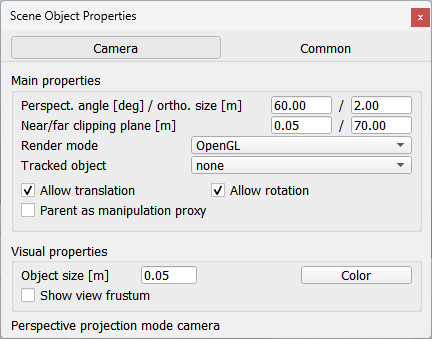

# Властивості камери

Властивості камери є частиною діалогового вікна [властивостей об’єкта сцени](https://www.coppeliarobotics.com/helpFiles/en/sceneObjectPropertiesDialog.htm), яке знаходиться в [Інструменти > Властивості об’єкта сцени]. Ви також можете відкрити діалогове вікно подвійним клацанням піктограми об’єкта в [ієрархії сцени](https://www.coppeliarobotics.com/helpFiles/en/userInterface.htm#SceneHierarchy) або клацанням кнопки [панелі інструментів](https://www.coppeliarobotics.com/helpFiles/en/userInterface.htm#toolbars):

[Кнопка панелі інструментів властивостей об’єкта сцени]

У діалоговому вікні властивостей об’єкта сцени клацніть кнопку «Камера», щоб відкрити діалогове вікно камери (кнопка «Камера» з’являється, лише якщо останнім вибраним є [камера](<../Cameras/Cameras.md>)). У діалоговому вікні відображаються налаштування та параметри останньої вибраної камери. Якщо вибрано більше однієї камери, деякі параметри можна скопіювати з останньої вибраної камери до інших вибраних камер (Застосувати до кнопок вибору):

[Діалогове вікно камери]

- Кут перспективи: максимальний кут розкриття трапеції огляду, коли камера перебуває в режимі перспективної проекції
- Орфографічний розмір: ортографічний розмір проекції (або розмір перегляду), коли камера перебуває в режимі ортографічної проекції.
- Ближня/далека площина відсікання: відстань від початкової точки камери, з якої камера починає/припиняє бачити. Якщо близькі / далекі об'єкти не повинні відображатися, збільште / зменшіть це значення. Ці параметри безпосередньо пов’язані з точністю візуалізації, особливо коли пов’язане подання знаходиться в режимі перспективної проекції, тоді ви завжди повинні стежити, щоб не було занадто великого проміжку між дальньою та ближньою площинами відсікання, інакше ви можете зіткнутися з деякими відомими візуальними артефактами. як z-fighting (коли поверхні або пікселі, розташовані далі, здається, що перекривають поверхні/пікселі, розташовані ближче до камери).
- Режим візуалізації: режим візуалізації камери.
- Відстежуваний об’єкт: об’єкт, який буде відстежуватися камерою. Відстеження об’єкта не вплине на положення камери, лише її орієнтація буде автоматично налаштована, щоб стежити за об’єктом.
- Дозволити переміщення: дозволено переміщення камери.
- Дозволити обертання: дозволено обертання камери.
- Батьківський як проксі-сервер маніпуляції: якщо ввімкнено, то кнопки панелі інструментів керування камерою не впливатимуть безпосередньо на положення камери, а натомість впливатимуть на батьківський об’єкт камери. Цей параметр корисний, якщо ви хочете мати кілька камер, пов’язаних одна з одною (наприклад, сцена за замовчуванням у CoppeliaSim має 3 камери, розташовані ортогонально одна до одної. Якщо одну перемістити, дві інші підуть за нею).
- Розмір об'єкта: розмір камери. Цей параметр має лише візуальний ефект і не має функціонального значення.
- Колір: дозволяє регулювати колір камери.
- Показати кут зору: якщо вибрано, буде показано кут зору (об’єм).
