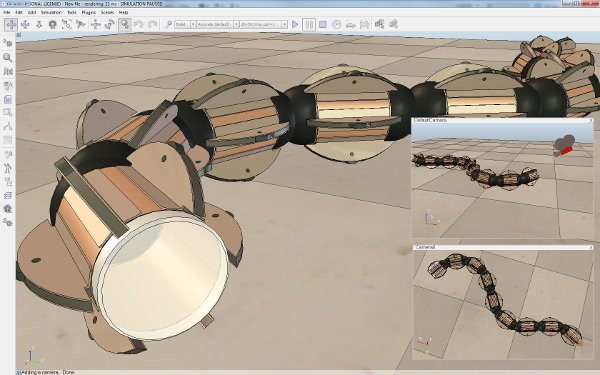

# Камери

Камери є видимими об’єктами, що означає, що ви можете дивитися крізь них і відображати те, на що вони дивляться. У вашій сцені ви можете мати стільки камер, скільки потрібно, кожна з них пропонує різні види сцени. Нижче показано приклад сцени, що містить кілька камер:

[Сцена, що відображає види трьох різних камер]

