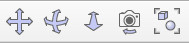
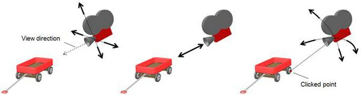

# Камери

Камери - це видимі об’єкти [видимі об’єкти](https://www.coppeliarobotics.com/helpFiles/en/viewableObjects.htm), що означає, що ви можете дивитися крізь них і відображати те, на що вони дивляться. На вашій [сцені](https://www.coppeliarobotics.com/helpFiles/en/viewableObjects.htm) ви можете мати стільки камер, скільки потрібно, кожна з них пропонує різні [види](https://www.coppeliarobotics.com/helpFiles/en/viewableObjects.htm) сцени. Нижче показано приклад сцени, що містить кілька камер:

[Сцена, що відображає види трьох різних камер]

Не переплутайте камери з [датчиками зору](https://www.coppeliarobotics.com/helpFiles/en/visionSensors.htm). Нижче наведено основні відмінності:
- Камера не має певної роздільної здатності (тобто вона автоматично підлаштовується під розмір огляду). Датчик зору має фіксовану роздільну здатність.
- Вміст зображення камери не доступний через [API](https://www.coppeliarobotics.com/helpFiles/en/apisOverview.htm) (але через механізм зворотного виклику), а обробка зображень безпосередньо не підтримується. Доступ до вмісту зображення датчика зору можна отримати через API та обробити за допомогою [функцій зворотнього виклику](https://www.coppeliarobotics.com/helpFiles/en/apisOverview.htm).
- Камера зазвичай потребує менше процесорного часу та працює швидше, ніж датчики зору.
- Камера може відображати всі [типи об'єктів](https://www.coppeliarobotics.com/helpFiles/en/objects.htm). Датчик зору в основному відображає [форми](https://www.coppeliarobotics.com/helpFiles/en/shapes.htm).

Камеру можна додати до сцени за допомогою [Додати > Камера]. Однак додавання камери таким чином додасть об’єкт у дефолтну позицію та орієнтацію. Найкраще додавати камери, клацнувши правою кнопкою миші на певний вид сцени та вибравши [Вспливаюче меню > Додати > Камера]. Це додасть об’єкт безпосередньо перед поточним переглядом. Додана камера вибирається автоматично, і ви можете переглядати її за допомогою [Вспливаюче меню > Перегляд > Зв’язати перегляд з вибраною камерою]. Щоб це працювало, вам потрібно переконатися, що вспливаюче меню активовано в поточному перегляді. Коли перегляд створений, але ще не пов’язаний з видимим об’єктом, команда [Вспливаюче меню > Додати > Камера] додасть камеру та безпосередньо пов’яже її з переглядом (тобто переглядати через це). Камера може бути пов’язана з будь-якою кількістю переглядів.

Крім того, ви також можете пов’язати перегляд з камерою, активувавши таке спливаюче вікно в перегляді: [Вспливаюче меню > Перегляд > Вибір перегляду..]. Це дозволить вам вибрати потрібний вигляд камери у вікні попереднього перегляду.

[Кнопки панелі інструментів навігації камери: панорамування, поворот, зміщення, масштабування та підгонка до перегляду]

- Кнопка панорамування: дозволяє зміщувати камеру в площині, перпендикулярній напрямку огляду. Клацнута точка на сцені буде зміщуватися з тією ж швидкістю, що й рух миші. Якщо не клацнути жодної конкретної точки (тобто, коли клацнути фон), операція зсуву буде виконана для невидимої точки поблизу камери.
- Кнопка повороту: дозволяє обертати камеру навколо клацаної точки сцени. Якщо не клацнути жодної конкретної точки (тобто, коли клацнути фон), операція обертання буде виконана навколо невидимої точки поблизу камери.
- Кнопка зміщення: дозволяє зміщувати камеру вздовж напрямку огляду. Це має ефект масштабування на камерах, які перебувають у режимі перспективної проекції, але види камер у режимі ортогональної проекції можуть не мати жодного ефекту (проте камери буде зміщено вздовж напрямку огляду).
- Кнопка кута камери: дозволяє регулювати кут перспективної проекції виду камери (у режимі перспективної проекції) або дозволяє регулювати розмір огляду камери (у режимі ортогональної проекції).
- Кнопка відповідності розміру: налаштовує камеру перегляду, яка має фокус, щоб гарно обрамити всі вибрані об’єкти або всю сцену, якщо об’єкт не вибрано.

У той час як ліва кнопка миші дозволяє виконувати вищезазначені операції, колесо миші дозволяє зміщувати камеру вздовж напрямку огляду (якщо вид камери знаходиться в режимі перспективної проекції) або дозволяє регулювати розмір огляду камери (якщо вид камери знаходиться в режим ортогональної проекції). Якщо клацнути праву кнопку без руху миші, буде активовано спливаюче меню, однак, якщо праву кнопку тримати натиснутою під час переміщення миші, можна досягти повороту камери навколо точки клацання.

Коли кнопка зсуву камери активована, дуже легко переміщатися в сцені в будь-яке потрібне положення та орієнтацію за допомогою: (1) ліва кнопка миші для переміщення перпендикулярно напрямку огляду, (2) колесо миші для переміщення вздовж напрямку перегляду, і (3) права кнопка миші для обертання навколо клацаної точки:

[Навігація камери за замовчуванням: (1) панорамування лівою кнопкою миші, (2) переміщення коліщатком миші, (3) обертання правою кнопкою миші]

Камери можуть автоматично відстежувати об’єкти (тобто стежити за ними під час їхнього руху), вибравши об’єкт для відстеження, а потім обравши у відповідному перегляді [Вспливаюче меню > Перегляд > Відстежити вибраний об’єкт]. Камера стеження збереже своє положення, але автоматично регулює напрямок огляду, щоб завжди тримати об’єкт для відстеження в полі зору. Це відрізняється від камери, приєднаної до цього об’єкта через «батьківсько-дочірні» стосунки.
