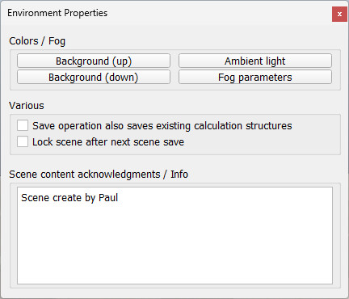

# Діалог середовища

Діалогове вікно середовища можна відкрити за допомогою [Інструменти > Середовище] або подвійним клацанням наступної піктограми в ієрархії сцени:

[Environment icon]

[Environment dialog]

- Фон (вгору/вниз): дозволяє регулювати колір фону сцени. Верхній компонент відповідає верхній частині екрана (небо), нижній компонент відповідає нижній частині екрана. Кольори фону видно лише тоді, коли функцію туману вимкнено.
- Навколишнє освітлення: дозволяє регулювати навколишнє освітлення [сцени](https://www.coppeliarobotics.com/helpFiles/en/scenes.htm). Навколишнє освітлення можна розглядати як мінімальне освітлення сцени, воно освітлює об’єкт однаково з усіх боків. Дивіться [розділ про освітлення](https://www.coppeliarobotics.com/helpFiles/en/lights.htm), щоб дізнатися більше про освітлення сцени.
- Параметри туману: дозволяє регулювати різні параметри туману.
- Операція збереження також зберігає існуючі структури обчислень: для обчислень [відстані](https://www.coppeliarobotics.com/helpFiles/en/distanceCalculation.htm), [виявлення зіткнень](https://www.coppeliarobotics.com/helpFiles/en/collisionDetection.htm) тощо структура даних обчислюється на початку моделювання (попередня обробка) або вперше, коли [форма](https://www.coppeliarobotics.com/helpFiles/en/shapes.htm) залучається до таких обчислень, щоб прискорити обчислення. Розрахунок цієї структури даних може зайняти багато часу, тому користувач може зберегти її разом зі [сценою](https://www.coppeliarobotics.com/helpFiles/en/scenes.htm) чи [моделлю](https://www.coppeliarobotics.com/helpFiles/en/models.htm). Однак слід пам’ятати, що додаткова інформація, яка буде збережена, є великою та призведе до збільшення розміру файлів (іноді вдвічі чи більше).
- Заблокувати сцену після збереження наступної сцени: виберіть цей пункт, якщо ви хочете заблокувати свою сцену від редагування/модифікації, перегляду вмісту сценарію та експорту ресурсу. Після наступної операції збереження сцени сцена буде заблокована. Переконайтеся, що ви зберегли ту саму сцену в розблокованому стані, якщо ви хочете мати можливість змінити її пізніше.
- Згадка вмісту сцени / Інформація: інформація, пов’язана зі сценою. Завжди добре вказувати оригінального автора сцени, [моделі](https://www.coppeliarobotics.com/helpFiles/en/models.htm) чи імпортованої сітки. Коли відкривається сцена, яка містить інформацію про підтвердження, вона автоматично відображатиме цю інформацію.
